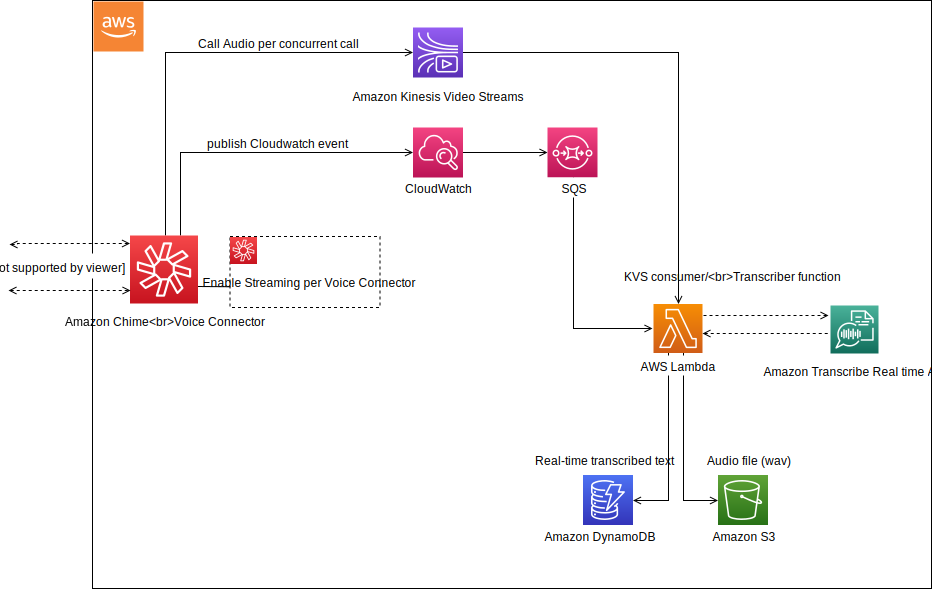
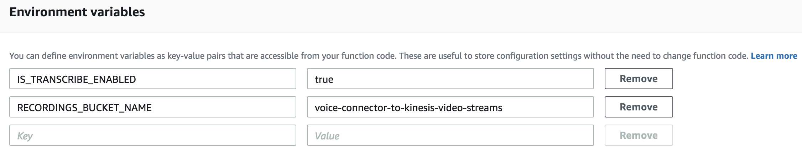

# Amazon Chime Voice Connector Real-Time Transcription Lambda

Making it easy to get started with Amazon Chime Voice Connector live audio streaming and real-time transcription using Amazon Transcribe.

## On this Page
- [Project Overview](#project-overview)
- [Architecture Overview](#architecture-overview)
- [Getting Started](#getting-started)
- [Lambda Environment Variables](#lambda-environment-variables)
- [Lambda Invocation Event Details](#lambda-invocation-event-details)
- [Sample Trigger Lambda](#Sample-trigger-Lambda-function)

## Project Overview
The purpose of this project is to provide a code example and a fully functional Lambda function to get you started with capturing and transcribing Amazon Chime Voice Connector phone calls using Amazon Kinesis Video Streams and Amazon Transcribe. This Lambda function can be used to create varying solutions such as capturing audio on calls for real time actions on transcriptions, or creating a call recording solution. To enable these different use-cases there are multiple [environment variables](#lambda-environment-variables) required for the lambda function.

## Architecture Overview


### Description
This solution can be configured using the following services: [Amazon Chime](https://aws.amazon.com/chime/) - Voice Connector, [Amazon Kinesis Video Streams](https://aws.amazon.com/kinesis/video-streams), [Amazon CloudWatch](https://aws.amazon.com/cloudwatch/), [Amazon Simple Queue Service](https://aws.amazon.com/sqs/), [Amazon Transcribe](https://aws.amazon.com/transcribe), [Amazon DynamoDB](https://aws.amazon.com/dynamodb), [AWS Lambda](https://aws.amazon.com/lambda), and [Amazon S3](https://aws.amazon.com/s3).

With [Amazon Chime](https://aws.amazon.com/chime/) Voice Connector, customer audio can be live streamed to Kinesis Video Streams as described in this [Amazon Chime documentation] (https://docs.aws.amazon.com/chime). This project serves as an example of how to consume an Amazon Chime Voice Connector live audio stream, capture the audio and send it to S3 in the form of an audio wav file, as well as perform real-time transcription using [Amazon Transcribe](https://aws.amazon.com/transcribe) and posting those transcriptions to a DynamoDB table. 

In the diagram above, once a call is connected to Amazon Chime Voice Connector:

 - (Step 1) In the Amazon Chime Voice Connector configuration page in the AWS Chime Console
    - Ensure "start" is selected in the Streaming tab next to "Send to Kinesis Video Streams"
    - Amazon Chime Voice connector will create a stream for each concurrent call party (2 streams per call) while this option is selected and publish CloudWatch events with the TransactionId, Kinesis Video Stream ARN, and Fragment Number when a call starts.
- (Step 2) A CloudWatch event rule is created to take these events and send them to a target SQS Queue
- (Step 3) A Lambda function is created using the sample code in this repository to trigger off of this SQS Queue. This Lambda will serve as a Kinesis Video Stream (KVS) Consumer/transcriber and will continue to process audio for a maximum of 15 minutes (Lambda limit) or until the call is disconnected.
- (Step 4) The Lambda function will take the transcripts returned from Amazon Transcribe and save the transcripted segments to a DynamoDB table.  It will also save the audio bytes to a file when the call ends and upload to S3 as a wav file.


The Lambda code expects the Kinesis Video Stream details provided by the Amazon CloudWatch Event including `transactionId`, `streamArn` and `startFragmentNumber`.The handler function of the Lambda is present in `KVSTranscribeStreamingLambda.java` and it uses the GetMedia API of Kinesis Video Stream to fetch the InputStream of the customer audio call. The InputStream is processed using the AWS Kinesis Video Streams provided Parser Library. If the `transcriptionEnabled` property is set to true on the input, a TranscribeStreamingRetryClient client is used to send audio bytes of the audio call to Transcribe. As the transcript segments are being returned, they are saved in a DynamoDB table having TransactionId as the Partition key and StartTime of the segment as the Sort key. The audio bytes are also saved in a file along with this and at the end of the audio call, if the `saveCallRecording` property is set to true on the input, the WAV audio file is uploaded to S3 in the provided `RECORDINGS_BUCKET_NAME` bucket. 

As of this writing Amazon Transcribe supports real time transcription of British English (en-GB), US English (en-US), French (fr-FR), Canadian French (fr-CA); and US Spanish (es-US). See the Amazon Transcribe [streaming documentation](https://docs.aws.amazon.com/transcribe/latest/dg/streaming.html) for the latest supported languages.

## Getting Started
Getting started with this project is easy. The most basic use case of capturing audio in the Amazon Chime Voice Connector can be accomplished by downloading the pre-packaged Lambda Function, deploying it in your account, giving it the correct permissions to access S3 and KVS, and then invoking it and passing the details in the invocation event.

### Easy Setup

The simplest way to get started is to:

1. Ensure that your Amazon Chime Voice Connector has the "Streaming" feature enabled by following the [Amazon Chime Voice Connector documentation](https://docs.aws.amazon.com/chime/xxxx) for "Enable Streaming"  
- Create (or use an existing) S3 bucket for the audio files to be uploaded

**Now you will have Call Recordings in S3**
   - 2 recording files for each call will be uploaded in S3 representing each call leg

**If you would like to use the real-time transcription feature:**

1. Create a DynamoDB table, with the "Partition Key" named `callId` and String data type along with "Sort Key" named `sequenceNumber` with Number data type
2. [Download](https://github.com/aws-samples/amazon-chime-voiceconnector-transcription) and deploy the pre-packaged Lambda function
    - Ensure that the lambda execution role assigned has access to the services you plan to enable
        - SQS, S3, CloudWatch, AmazonDynamoDB, AmazonTranscribe, AmazonKinesisVideoStreams
    - Set the timeout on the lambda function to the correct limit to handle the length of calls you plan on processing with this function (up to 15 min)
    - The handler for the lambda function is: `com.amazonaws.kvstranscribestreaming.KVSTranscribeStreamingLambda::handleRequest`
- Populate the [environment variables](#Lambda Environment Variables) with the correct details for your solution


### Building the project
The lambda code is designed to be built with Gradle. All requisite dependencies are captured in the `build.gradle` file. The code also depends on the [AWS Kinesis Video Streams Parser Library](https://github.com/aws/amazon-kinesis-video-streams-parser-library) which has been built into a jar can be found in the jars folder. Simply use `gradle build` to build the zip that can be deployed as an AWS Lambda application.

### Requirements
1. Create a table in DynamoDB with name "TranscriptionsData" with partition key as "CallId" of type String and sort key as "SequenceNumber" of type Number.  Transcriptions will be stored in this table.
2. Create SQS queue for which above created Lambda would poll for messages.
3. Create Lambda IAM role which has write permission to S3, DynamoDB, Transcribe, CloudWatch. It should also have read permission to SQS and Kinesis Video Streams.
4. Create the lambda function choosing Java 8 and upload the zip AWSVoiceConnectorToTranscribeLambda.zip package from the build folder that was built with Gradle above.
5. Create a CloudWatch event rule which gets triggered when Streaming to Kinesis starts and has target set to SQS queue created in previous step.
6. Create S3 bucket where call recordings will be stored and configure Lambda to use the same bucket by setting system variable `RECORDINGS_BUCKET_NAME`.


## SQS Queue
See [Creating an Amazon SQS Queue](https://docs.aws.amazon.com/AWSSimpleQueueService/latest/SQSDeveloperGuide/sqs-create-queue.html) for creating via console

If using the AWS CLI:

1. Create Standard SQS Queue
```
aws sqs create-queue --queue-name ChimeVoiceConnectorStreaming
```

2. Add Lambda function as a trigger to SQS Queue

```
aws lambda create-event-source-mapping \
 --function-name AWSVoiceConnectorToTranscribeLambda \
 --event-source-arn arn:aws:sqs:us-east-1:123456789012:ChimeVoiceConnectorStreaming
```

## CloudWatch Event Rule 
See [Create CloudWatch Events Rule](https://docs.aws.amazon.com/AmazonCloudWatch/latest/events/Create-CloudWatch-Events-Rule.html) for creating via console.

If using AWS CLI:

1. Create CloudWatch Event Rule

```
aws events put-rule \
 --name voiceConnectorToTranscribe \
 --event-pattern '{"source": ["aws.chime"]}'
```
 

2. Set SQS ARN created previously as target for above created rule

```
aws events put-targets \
 --rule voiceConnectorToTranscribe \
 --targets Id=1,Arn=arn:aws:sqs:us-east-1:123456789012:ChimeVoiceConnectorStreaming 
```
 


## Lambda Environment Variables
This Lambda Function has environment variables that control its behavior:

* `IS_TRANSCRIBE_ENABLED` - Set to "true" if enabling transcription of calls.
* `RECORDINGS_BUCKET_NAME` - The AWS S3 bucket name where the audio files will be saved (Lambda needs to have permissions to this bucket)

### Sample Lambda Environment Variables


## Lambda Invocation Event Details
This Lambda Function will need some details when triggered by the SQS queue event:

* `streamArn` - The ARN of the Kinesis Video stream that includes the customer audio, this is provided by Amazon CloudWatch event when streaming is started successfully
* `startFragmentNumber` - Identifies the Kinesis Video Streams fragment in which the customer audio stream started, this is provided by Amazon CloudWatch event when streaming is started successfully
* `transactionId` - Identifies the call and used in associating the audio recording
* `callId` - Identifies each call leg

### Sample Lambda Invocation Event
The following is a sample invocation event.  

```{
    "records": [
        {
            "messageId": "aee5166b-6f11-44c6-aee9-155ac5c169d6",
            "receiptHandle": "AQEBDvYQqYMQZ1VUlzDRRLndliCPnDMnL9jgzL48yOGuAHy3xQZUSyGVj00HMvjMEGZn+H868xk4WrWgOxO0tNE8iPg/u2fQGMjHiXDHw3z6sl76EtCOXK4K/k33zgxOXIy5pZdR0HAdD6LYgXtVYjqcnEFym02/wP5u5joqU2KNrd/NOi5gNmEyZGSI3wYQ86Mz310lc4VCAFCsYZeGqykWw5TuTcOubaqgbSsqraaTRL4R1j2nsBqozkCFqX2a4YA8qL9SfgqCLDHpTJkWeV9Tx7dTky1xordzoxFtqvXjrMiFCnx12Z0gEqZ4coOtqICNb3NahuNOJiccT3fGuiy6b6zgLevTnGH+Yzc6My0oR8SbOX1f/sFXvfnh+JG+JTsdXE0famGAsWChNKfDqpM5YQ==",
            "body": "{\"version\":\"0\",\"id\":\"bc2c1ea5-19dd-d03b-4149-7b6c70077ccb\",\"detail-type\":\"Chime VoiceConnector Streaming Status\",\"source\":\"aws.chime\",\"account\":\"123456789012\",\"time\":\"2019-09-27T16:08:04Z\",\"region\":\"us-east-1\",\"resources\":[],\"detail\":{\"callId\":\"cfb57784-5be3-1238-04b6-02246e5f89ae\",\"direction\":\"Outbound\",\"mediaType\":\"audio/L16\",\"startFragmentNumber\":\"91343852333182576249278362314619637737608003331\",\"startTime\":\"2019-09-27T16:08:02.702Z\",\"streamArn\":\"arn:aws:kinesisvideo:us-east-1:262247412438:stream/ChimeVoiceConnector-fo6zye2x3gr0vjugxb0k5i-0da7cc9d-b151-423c-8cd7-0ed2e1887bca/1569388023478\",\"transactionId\":\"24f48be4-2036-41d5-a6f8-f25e486b76c6\",\"voiceConnectorId\":\"fo6zye2x3gr0vjugxb0k5i\",\"streamingStatus\":\"STARTED\",\"version\":\"0\"}}",
            "md5OfBody": "bd47cdd3c08604c9ec28cac31e3604c2",
            "md5OfMessageAttributes": null,
            "eventSourceArn": "arn:aws:sqs:us-east-1:123456789012:ChimeVoiceConnectorStreaming",
            "eventSource": "aws:sqs",
            "awsRegion": "us-east-1",
            "attributes": {
                "ApproximateReceiveCount": "1",
                "SentTimestamp": "1569600485134",
                "SenderId": "AIDAJWMS6ZT4JN5U4ZWVO",
                "ApproximateFirstReceiveTimestamp": "1569600485135"
            },
            "messageAttributes": {}
        }
    ]
}
```

### Sample CloudWatch Event

```
{ 
   version=0,
   id=bc2c1ea5-19dd-d03b-4149-7b6c70077ccb,
   detail-type=Chime VoiceConnector Streaming Status,
   source=aws.chime,
   account=12345678,
   time=2019-09-27T16:08:04Z,
   region=us-east-1,
   resources=   [],
   detail=   { 
      callId=cfb57784-5be3-1238-04b6-02246e5f89ae,
      direction=Outbound,
      mediaType=audio/L16,
      startFragmentNumber=91343852333182576249278362314619637737608003331,
      startTime=2019-09-27T16:08:02.702Z,
      streamArn=arn:aws:kinesisvideo:us-east-1:12345678:stream/ChimeVoiceConnector-fye2x3gr0vjugxb0k5i-0da7cc9d-b151-423c-8cd7-0ed2e1887bca/1569388023478,
      transactionId=24f48be4-2036-41d5-a6f8-f25e486b76c6,
      voiceConnectorId=fye2x3gr0vjugxb0k5i,
      streamingStatus=STARTED,
      version=0
   }
}
```

